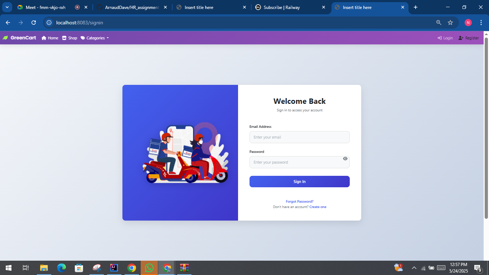
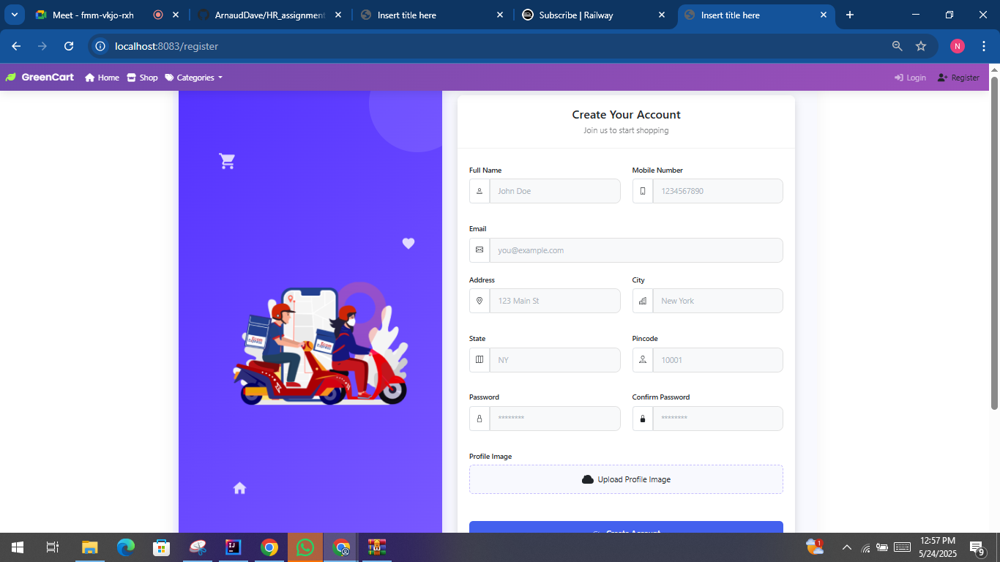

# E-commerce Web Application

**Faculty of Information Technology**  
**Course:** Web Technology & Internet (INSY-413)  
**Student Name:** Nahayo Arnaud  
**Student ID:** 24849  
**Project Type:** Mini Project  
**Due Date:** 18 May 2025

## 📄 Project Description

This is a simple e-commerce web application developed as part of the INSY-413 Web Technology & Internet course. The application is built using **Spring Boot** for the backend and **Thymeleaf** for the frontend. It supports basic functionalities for both **customers** and **admins**, including product management, user authentication, shopping cart, and order processing.

---

## 👥 User Stories

### 🛒 Customer
- Browse products and view their details.
- Add products to the shopping cart.
- View cart and proceed to checkout.
- Register/login to manage orders.

### 🛠 Admin
- Add and manage products.
- View and update order status.

---

## ⚙️ Project Setup Instructions

1. Create a new Spring Boot project using Maven in IntelliJ.
2. Configure database connectivity (e.g., MySQL).
3. Use Spring Data JPA for database interaction.
4. Implement authentication and authorization using Spring Security.

---

## 🧩 Backend (Spring Boot) Features

- Role-based access control (USER, ADMIN).
- CRUD APIs for Product Management.
- Order placement and history tracking.
- Entity relationships: `User`, `Product`, and `Order`.
- RESTful APIs using HTTP methods: GET, POST, PUT, DELETE.

---

## 🎨 Frontend (Thymeleaf) Features

- UI components for product listing, authentication, cart, and orders.
- Styling with Bootstrap.
- Integration with backend APIs for all major functionalities.
- Login & Signup forms integrated with Spring Security.
- Shopping cart with add/remove functionality and total calculation.
- Checkout process handling.
- Form validations using Spring's validation framework.
- Static resources (CSS/JS) management.

---

## 🚨 Error Handling

- Backend and frontend validations with proper error messages.
- Graceful error pages for unauthorized access or invalid operations.

---

## ☁️ Deployment

- Deployed on [Heroku/AWS/Azure] *(Replace with your platform)*.
- GitHub repository is public and accessible.

---

## 📂 Screenshots

> *Include screenshots of the following components:*
- [ ] Login Page
- [ ] Register Page
- [ ] Product Listing
- [ ] Product Details
- [ ] Shopping Cart
- [ ] Checkout Page
- [ ] Admin Dashboard
- [ ] Add Product Form
- [ ] Order Management

*(Upload screenshots in the `/screenshots` folder and embed using markdown syntax.)*

```markdown


...
# E-commerce Web Application

**Faculty of Information Technology**  
**Course:** Web Technology & Internet (INSY-413)  
**Student Name:** Nahayo Arnaud  
**Student ID:** 24849  
**Project Type:** Mini Project  
**Due Date:** 18 May 2025  

## 📄 Project Description

This is a simple e-commerce web application developed as part of the INSY-413 Web Technology & Internet course. The application is built using **Spring Boot** for the backend and **Thymeleaf** for the frontend. It supports basic functionalities for both **customers** and **admins**, including product management, user authentication, shopping cart, and order processing.

---

## 👥 User Stories

### 🛒 Customer
- Browse products and view their details.
- Add products to the shopping cart.
- View cart and proceed to checkout.
- Register/login to manage orders.

### 🛠 Admin
- Add and manage products.
- View and update order status.

---

## ⚙️ Project Setup Instructions

1. Create a new Spring Boot project using Maven in IntelliJ.
2. Configure database connectivity (e.g., MySQL).
3. Use Spring Data JPA for database interaction.
4. Implement authentication and authorization using Spring Security.

---

## 🧩 Backend (Spring Boot) Features

- Role-based access control (USER, ADMIN).
- CRUD APIs for Product Management.
- Order placement and history tracking.
- Entity relationships: `User`, `Product`, and `Order`.
- RESTful APIs using HTTP methods: GET, POST, PUT, DELETE.

---

## 🎨 Frontend (Thymeleaf) Features

- UI components for product listing, authentication, cart, and orders.
- Styling with Bootstrap.
- Integration with backend APIs for all major functionalities.
- Login & Signup forms integrated with Spring Security.
- Shopping cart with add/remove functionality and total calculation.
- Checkout process handling.
- Form validations using Spring's validation framework.
- Static resources (CSS/JS) management.

---

## 🚨 Error Handling

- Backend and frontend validations with proper error messages.
- Graceful error pages for unauthorized access or invalid operations.

---

## ☁️ Deployment

- Deployed on [Heroku/AWS/Azure] *(Replace with your platform)*.
- GitHub repository is public and accessible.

---

## 📂 Screenshots

> *Include screenshots of the following components:*  
- [ ] Login Page  
- [ ] Register Page  
- [ ] Product Listing  
- [ ] Product Details  
- [ ] Shopping Cart  
- [ ] Checkout Page  
- [ ] Admin Dashboard  
- [ ] Add Product Form  
- [ ] Order Management  

*(Upload screenshots in the `/screenshots` folder and embed using markdown syntax.)*

```markdown


...
